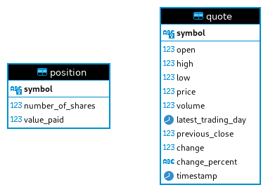

# Stock-Quote App

This is a Java application that allows the users to retrieve up-to-date stock quote details from the Alpha Vantage api and stores them in a database.
Additionally, it allows the users to buy and sell shares and persist the details of their transactions in a database as well.
This app utilizes the DAO pattern to separate the data access logic from the business logic and provide an abstract interface to interact with the database.
the DAO pattern was implemented by using the JDBC api with a local instance of PSQL as a docker container.
The OkHttp client library was utilized to handle Alpha Vantage api's requests and responses, and the Jackson library was utilized for processing JSON data through its efficient serialization and deserialization capabilities.
A service layer was also implemented by using 2 classes to handle the business logic of retrieving the data and the buying and selling of shares.
Furthermore, a controller layer was designed to handle user interactions by providing a command-line user interface.
To ensure that the data access and service layer operations were implemented correctly, unit and integration test cases were implemented using JUnit and Mockito.
Logging was also implemented for debugging and showcasing the flow of the application using Slf4j and Logback. Finally, the app was dockerized and pushed to Dockerhub.

# Implementation

## ER Diagram

## Design Pattern

The DAO pattern was utilized in this application to isolate the data access layer of the application from the business logic layer.
This is very beneficial because it provides an abstraction interface to interact with the database.
This isolation makes the code modification and maintenance easier and everything can be managed within the DAO layer without affecting the rest of the application.
It also makes testing easier through mocking data access operations. Furthermore, the DAO provides the flexibility to support multiple data sources.
For the purpose of this project a CrudDao interface was created which supports save, find by id, find all, delete by id and delete all operations for entities.
Then, a QuoteDao and PositionDao class were created to implement the functionalities of the CrudDao interface.

# Test

The unit and integration testing for this project was done on the data access layer and the service layer. JUnit and Mockito were utilized for the implementation.

## Setup

- Run a local PSQL container as the database with port: 5432.
- Create a new database in PSQL and name it stock_quote.
- Provide these environment variables when running the test: USER=[db_username_value] PASSWORD=[db_password_value] API=[AlphaVantage_API_Key]
- The test data is automatically populated in the setup phase.

# Improvements

- Achieve better test coverage with improved isolation of dependencies.
- More optimized API handling.
- More logging coverage for debugging and application flow.
- Better UI.

