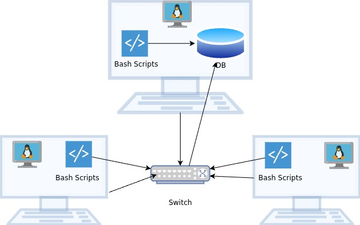

# Linux Cluster Monitoring Agent

The Linux Cluster Monitoring Agent is designed to collect and store hardware specifications (host name, number of cpus, cpu architecture, cpu model, cpu clock speed, L2 cache, and total memory) and resource usage (free memory, cpu idle time, Kernel time, disk io, and available disk) from each node in a cluster of Linux nodes. The data collected is stored in an RDBMS, for resource planning purposes by the cluster admins.
Bash, Docker, PSQL and Git were used for the implementation of this project.

# Quick Start

- Start a psql instance using psql_docker.sh  
```Bash
 ./scripts/psql_docker.sh create db_username db_password
 ./scripts/psql_docker.sh start
```
- Create tables using ddl.sql (Assuming the database is already created manually)
```Bash
psql -h hostname -U db_username -d db_name -f sql/ddl.sql
```
- Insert hardware specs data into the DB using host_info.sh  
```Bash
./scripts/host_info.sh psql_host psql_port db_name psql_user psql_password
```
- Insert hardware usage data into the DB using host_usage.sh  
```Bash
./scripts/host_info.sh psql_host psql_port db_name psql_user psql_password
```
- Crontab setup  
```Bash
* * * * * bash host_usage.sh_path psql_host psql_port db_name psql_user psql_password > /tmp/host_usage.log
```  

# Implementation

This project was implemented using Gitflow.  
1. Implemented the `psql_docker.sh` script in order to provision a psql instance using docker, to create a volume for data persistence, and to start or stop the container.
2. Set up a new database and implemented the `ddl.sql` file to automate table creations.
3. Implemented the `host_info.sh` script in charge of collecting hardware specification data and inserting them into the PSQL database.
4. Implemented the `host_usage.sh` script in charge of collecting server usage data and inserting them into the psql database.
5. Set up a cron job that executes the `host_usage.sh` script every minute to collect usage data continuously.  

## Architecture



- PSQL database to persist all the data.
- `host_info.sh` collects hardware specifications and inserts into the database.
- `host_usage.sh` collects usage data and inserts into the database every minute.  

## Scripts
- **psql_docker.sh:** This script is in charge of starting the docker daemon, creating a volume for data persistence, creating a container using postgres image(postgres:9.6-alpine)
and starting or stopping the container.

```Bash
# Usage
./scripts/psql_docker.sh start|stop|create db_username db_password

# Create a psql docker with username and password
./scripts/psql_docker.sh create db_username db_password

# Start the stopped psql docker container
./scripts/psql_docker.sh start

#stop the running psql docker container
./scripts/psql_docker.sh stop
```

- **ddl.sql:** This script is in charge of automating the creation of **host_info** and **host_usage** tables in an already existing database called **host_agent**

```Bash
# Create a database manually called host_agent before running the script

# Usage
psql -h host_name -U username -d db_name -f sql/ddl.sql

# example
psql -h localhost -U postgres -d host_agent -f sql/ddl.sql
```

- **host_info.sh:** The hardware specs are assumed to be static so this script only needs be executed once.
This script is in charge of collecting hardware specification data and inserting them into the database.
The hardware data that are collected: **hostname**, **number of cpus**, **cpu architecture**, **cpu model**, **cpu clock speed**, **l2 cache**, **total memory**, and **timestamp**.

```Bash
# Usage
./scripts/host_info.sh psql_host psql_port db_name psql_user psql_password

# Example
./scripts/host_info.sh localhost 5432 host_agent postgres password
```

- **host_usage.sh:** This script will run continuously every minute using `crontab` to collect server usage data and inserts them into the database.
The usage data that are collected: **amount of free memory**, **cpu idle time**, **kernel time**, **disk io**, **disk available at root**, and **timestamp**.

```Bash
# Usage
./scripts/host_usage.sh psql_host psql_port db_name psql_user psql_password

# Example
./scripts/host_usage.sh localhost 5432 host_agent postgres password
```

- **crontab:** crontab was used to automatically trigger the `host_usage.sh` script every minute in order to collect the data continuously and persist it in the database.

```Bash
# Edit crontab jobs
crontab -e

# Add to crontab
* * * * * bash host_usage.sh_file_path psql_host psql_port db_name psql_user psql_password > /tmp/host_usage.log
```

## Database Modeling

- **`host_info`**

| Name             | Type      | Constraint | Constraint |
|------------------|-----------|------------|------------|
| id               | SERIAL    | NOT NULL   | PK         |
| hostname         | VARCHAR   | NOT NULL   |            |
| cpu_number       | INT2      | NOT NULL   |            |
| cpu_architecture | VARCHAR   | NOT NULL   |            |
| cpu_model        | VARCHAR   | NOT NULL   |            |
| cpu_mhz          | FLOAT8    | NOT NULL   |            |
| l2_cache         | INT4      | NOT NULL   |            |
| "timestamp"      | TIMESTAMP | NULL       |            |
| total_mem        | INT4      | NULL       |            |

- **`host_usage`**

| Name           | Type      | Constraint | Constraint |
|----------------|-----------|------------|------------|
| "timestamp"    | TIMESTAMP | NOT NULL   |            |
| host_id        | SERIAL    | NOT NULL   | FK         |
| memory_free    | INT4      | NOT NULL   |            |
| cpu_idle       | INT2      | NOT NULL   |            |
| cpu_kernel     | INT2      | NOT NULL   |            |
| disk_io        | INT4      | NOT NULL   |            |
| disk_available | INT4      | NOT NULL   |            |

# Test

Testing was done manually for all the scripts. All the scripts were executed with different arguments to make sure error handling was done correctly.
The tables in the database were checked after successful script executions to check for correct data collection and persistence. 

# Deployment

Crontab was used to automate the continuous execution of the `host_usage` script.

# Improvements

- Handle hardware updates
- Automate database creation
- Collection and persistence of other useful data
- Automated testing